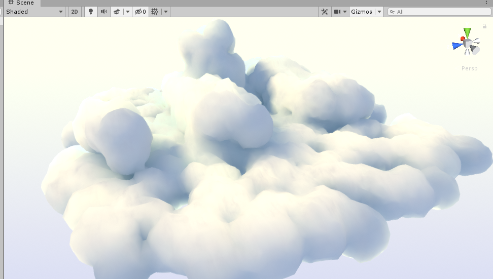

# UnlitClouds
A unity cloud shader, using vertex colors and tesselation for a simple stylized look

 i dont know how to do git readme properly...check out the detail of this here in the meantime : http://astroukoff.blogspot.com/2019/09/clouds-shader-breakdown.html

